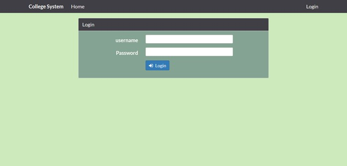
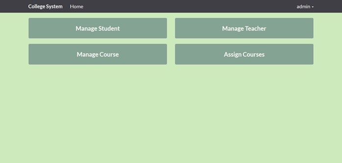
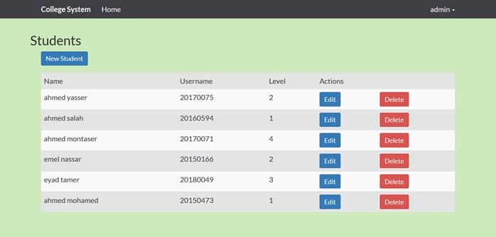
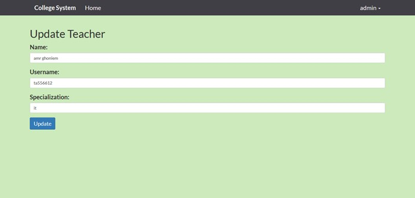
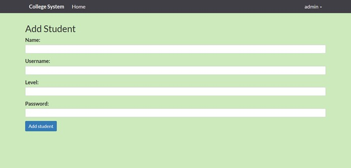
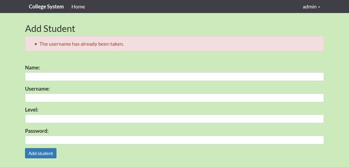
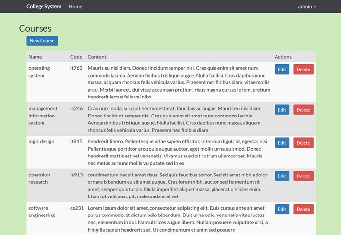
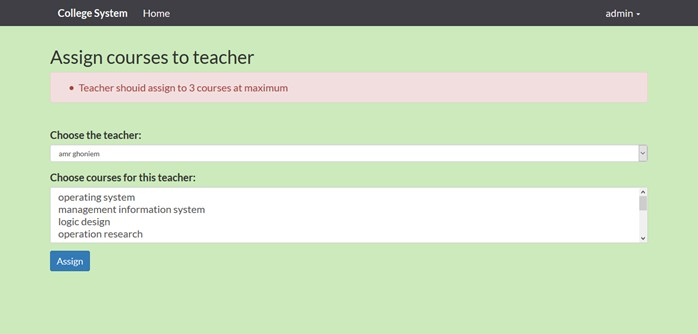
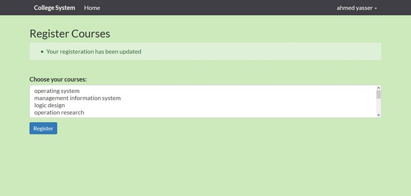
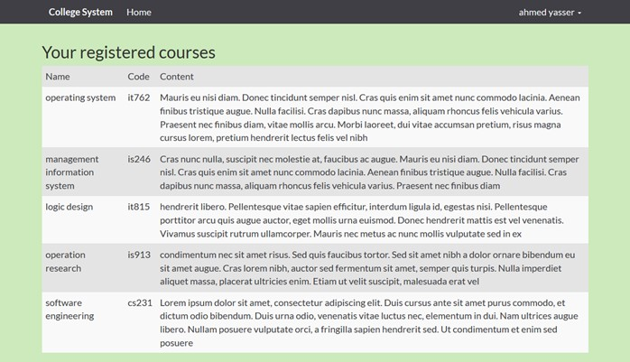

# College System

## About

this system is web based application system can be customized to suit the requirement of educational organization.

***

## Features:

#### system mainly contain three types of users:

##### Admin

<ul>
  <li>admin is almost has access to make any thing in system he can login and logout</li>
  <li>admin can manage all students in system (add,update,delete)</li>
  <li>admin can manage all teachers in system (add,update,delete)</li>
  <li>admin can manage all courses in system (add,update,delete)</li>
  <li>admin can assign any number of courses to any number of teachers and vice versa</li>
  <li>admin is responsible for to add any type of users in his organization into the system and this user</li>
  <li>can never access their functions</li>
</ul>

##### Student

<ul>
  <li>student can be only added into the system by the admin then he can login to the system by his username and password which have been set by the admin</li>
  <li>student can see the available courses in the current semester and chose from them to make registeration</li>
  <li>student can see his registerd courses</li>
  <li>student can update his registered courses</li>
</ul>

##### teacher

<ul>
  <li>teacher can be only added into the system by the admin then he can login to the system by his username and password which have been set by the admin</li>
  <li>teacher can see his assigned courses which have been set by the admin</li>
</ul>

***

### constraints of the system:

<ul>
  <li>every type of user (admin,student,teacher) must see different view and can not access the functions of another type</li>
  <li>student can only register in six courses as maximum</li>
  <li>admin can assign three courses for each teacher as maximum</li>
  <li>username is unique for each user in the system</li>
  <li>course code is unique for each course in the system</li>
</ul>

***

## 📱 Screenshots 

***

## ⚡ Technologies and libraries
* PHP
* Laravel Framework
* MySQL For Database
* Bootstrap 4 For UI
